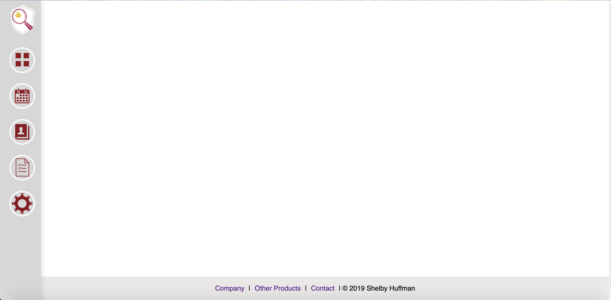

# Education Helper Application

The EHA was built to help curb the stress of managing calendars, due dates, contacts, and personal progress tracking that gets confused with many different platforms, software, or whatever it is that everyone chooses to use. The benefit of using this software is the centralization of your life that it offers.

## Current view snapshots

## Available Scripts

In the project directory, you can run:
- npm start
- npm test
- npm run build
- npm run eject
